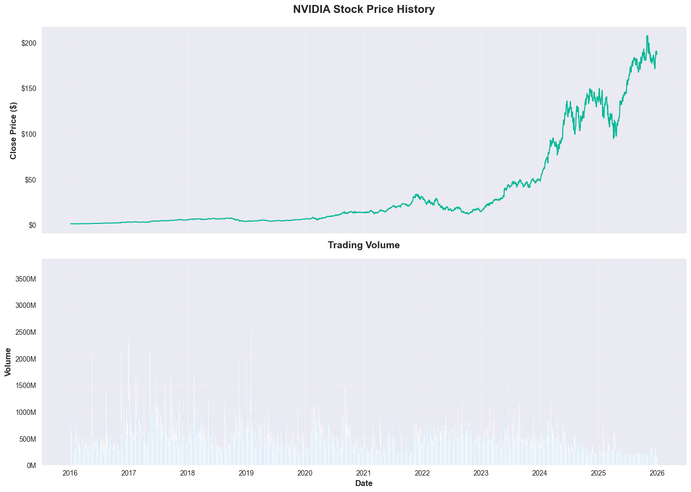
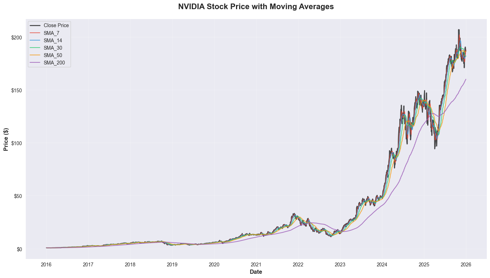
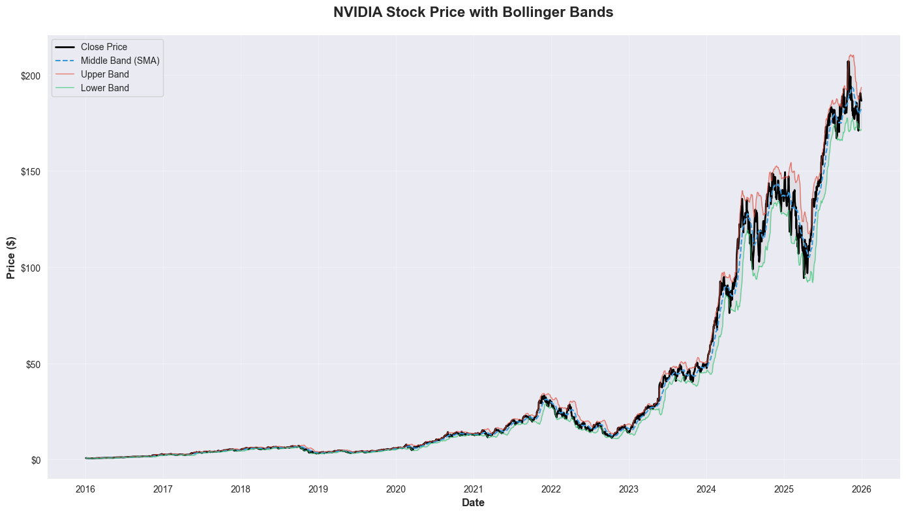
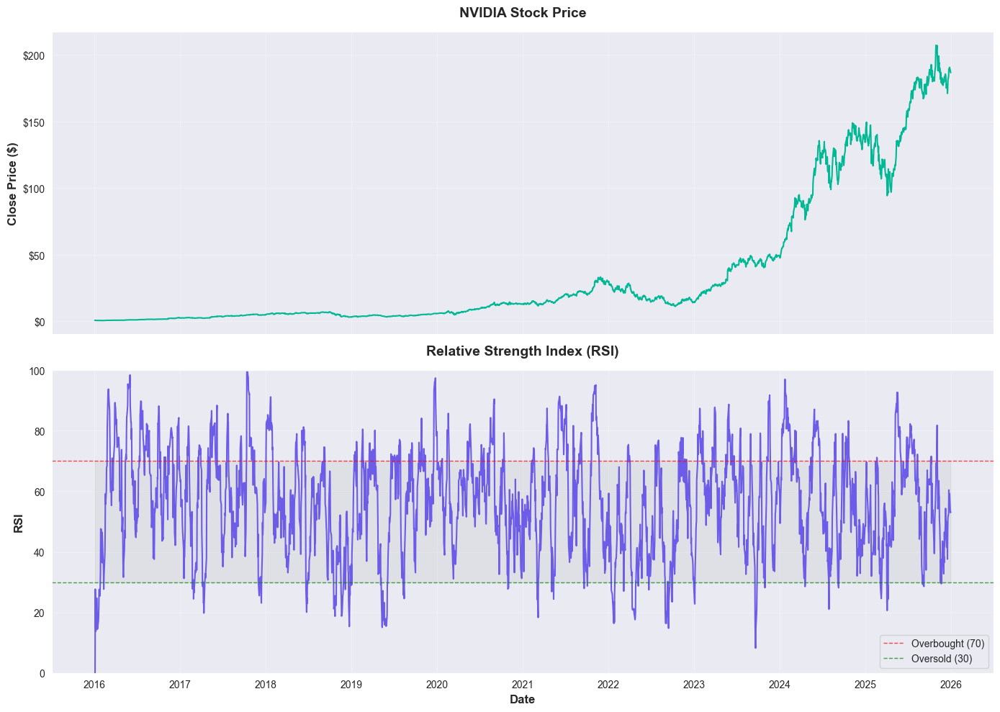
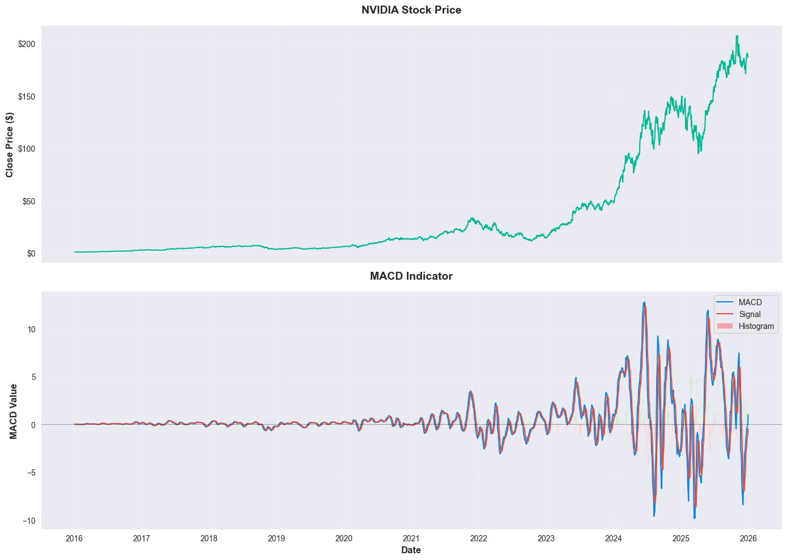
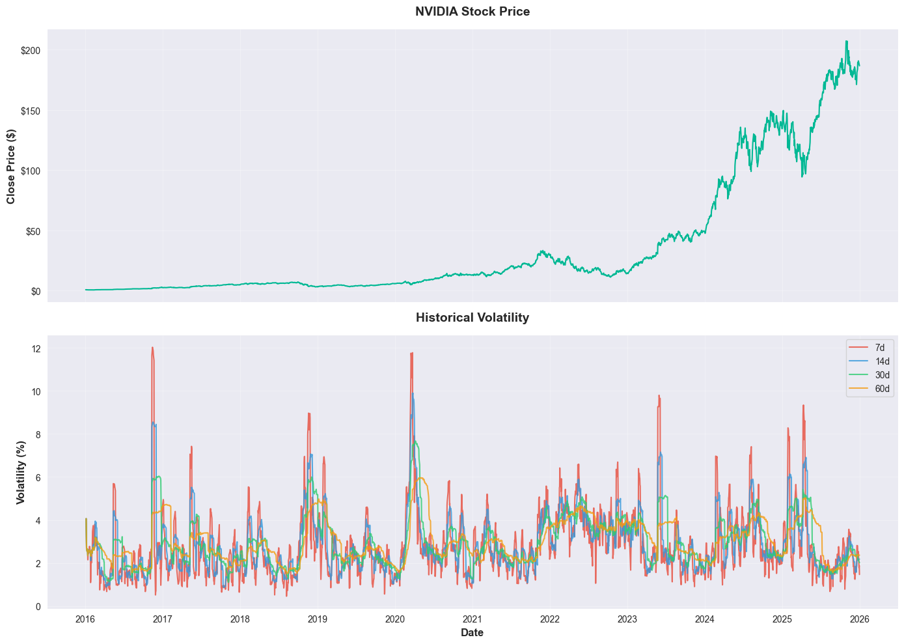
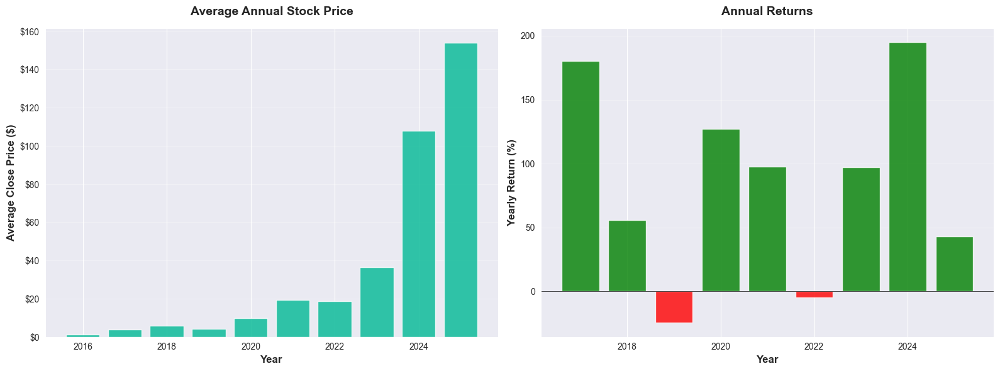
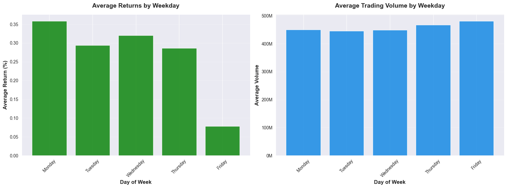

# NVIDIA Stock Analysis Pipeline

End-to-end, production-style data analysis pipeline for NVIDIA daily stock prices built with PySpark. The system ingests raw data from Kaggle, validates and transforms it, engineers technical features, runs statistical analysis, and produces visualization artifacts and CSV summaries.

## Features

- Automated dataset download from Kaggle and schema-validated ingestion
- Robust data cleaning and type conversions
- Temporal features (year, month, quarter, weekday)
- Price and volume features (returns, ranges, ratios)
- Technical indicators (SMA/EMA, Bollinger Bands, RSI, MACD, ATR, momentum)
- Risk metrics (daily volatility, VaR, Sharpe ratio)
- Comprehensive analysis reports and high-quality visualizations

## Requirements

- Python 3.11+
- uv package manager
- PySpark (runs in local mode; Java runtime recommended)
- Kaggle API credentials (KAGGLE_USERNAME, KAGGLE_KEY) or configured `~/.kaggle/kaggle.json`
- Dependencies listed in `requirements.txt`

## Installation

```bash
# Clone the repository
git clone <your-repo-url>
cd StockNivida

# Create and initialize the virtual environment with uv
uv venv .venv

# Install dependencies using uv
uv pip install -r requirements.txt

# Optional: Auto-setup (directories, env files, dependencies)
uv run build.py
```

Configure Kaggle credentials via either:
- Environment variables in `.env` (KAGGLE_USERNAME, KAGGLE_KEY), or
- Kaggle API token file at `~/.kaggle/kaggle.json` with `chmod 600`

## Usage

```bash
# Run the full pipeline
uv run main.py
```

The pipeline performs:
- Spark session creation and configuration
- Dataset download and data quality validation
- Feature engineering for technical indicators
- Multi-level analysis (yearly, monthly, quarterly, weekday)
- Visualization generation and result export

## Results

Artifacts are saved under `output/`:

```
output/
├── processed_data.parquet
├── processed_data_sample.csv
├── yearly_analysis.csv
├── monthly_analysis.csv
├── quarterly_analysis.csv
├── weekday_analysis.csv
└── visualizations/
    ├── price_history.png
    ├── moving_averages.png
    ├── bollinger_bands.png
    ├── rsi_indicator.png
    ├── macd_indicator.png
    ├── volatility_analysis.png
    ├── yearly_performance.png
    └── weekday_patterns.png
```

### Embedded Visualizations


*Historical closing price with corresponding trading volume.*


*Closing price overlaid with simple moving averages (SMA) windows (7, 14, 30, 50, 200).*


*Bollinger Bands showing the middle SMA and upper/lower envelopes to visualize volatility and extreme price regions.*


*Relative Strength Index (RSI) with overbought (70) and oversold (30) thresholds indicating momentum state.*


*MACD and Signal lines with histogram bars illustrating momentum shifts and crossover signals.*


*Historical volatility profiles across multiple window sizes (e.g., 7, 14, 30, 60 days).*


*Average annual closing price and yearly returns (positive/negative performance by year).*


*Average returns and average trading volume segmented by day of the week.*

## Examples

- Change analysis periods and indicator windows in [analysis_config.yaml](config/analysis_config.yaml), then re-run:
```bash
uv run main.py
```
- Inspect saved outputs:
```bash
ls output/
ls output/visualizations/
```
- Read the processed dataset sample in Python:
```python
import pandas as pd
pdf = pd.read_csv("output/processed_data_sample.csv")
print(pdf.head())
```

## License

This project is distributed under the MIT License. If a `LICENSE` file is not present, please add one declaring the terms for redistribution and use.
